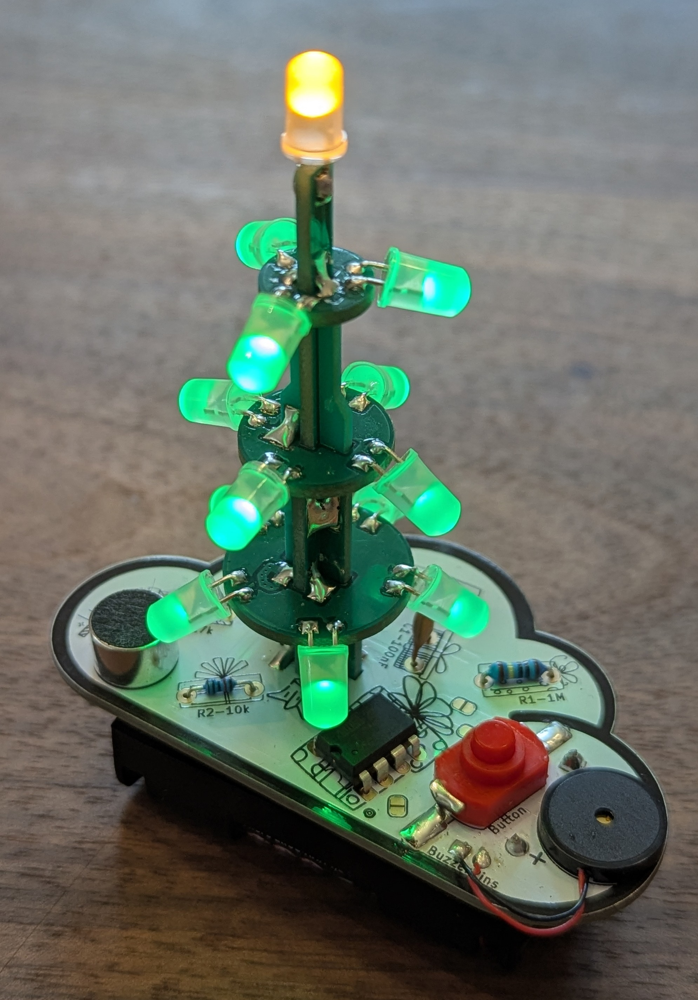

# BlinkyTree

An interactive ATtiny85-powered Christmas tree with LED effects and breath-controlled interaction.

<p align="center">
  
</p>

**Copyright (c) 2025 monkeyToneCircuits**  
**Licensed under CC-BY-NC 4.0** - See [LICENSE](LICENSE) file for details.

## Demo Video

<video src="media/BlinkyTree_ShowRun.mp4" width="400" controls></video>

*Video shows the candle effect, breath detection, and melody playback with LED frequency visualization.*

## Overview

BlinkyTree is my small project I invented a few years back that finally made it into the world! :)

It's an interactive Christmas tree that flickers in a candle-like manner. When you blow onto the microphone, the tree kicks off one of its songs, playing it on the buzzer. The LED rings blink in correspondence to the frequency of the notes in the songs.

Have fun with it, and if you want to build your own, you can get yours at [BlinkyParts.com](https://www.blinkyparts.com) very soon!

It's built around the ATtiny85 microcontroller.

## Features

- **Realistic Candle Effect**: Four LED rings flicker independently like real candles
- **Breath Detection**: Microphone sensor detects blowing
  - Light breath → Increased candle flickering intensity
  - Strong breath → Plays a Christmas melody
- **Audio Playback**: Built-in buzzer plays festive songs (Jingle Bells, Silent Night, etc.)
- **Modular Design**: Feature-configurable firmware for different hardware variants
- **Low Power**: Optimized for battery operation (60% Flash, 29% RAM usage)

## Project Structure

```
BlinkyTree/
├── src/
│   └── main.cpp              # Main application loop
├── lib/
│   ├── Hardware/             # Hardware abstraction (GPIO, PWM, ADC, timing)
│   ├── Lighting/             # LED effects and candle simulation
│   ├── Audio/                # Melody playback and tone generation
│   └── Sensors/              # Microphone sensor processing
├── config/
│   └── config.h              # Feature flags and hardware configuration
├── platformio.ini            # Build configuration
└── README.md
```

## Hardware Requirements
The set containing all components and pcbs can be bought here:
[BlinkyParts.com](https://www.blinkyparts.com)

### Components
- ATtiny85 microcontroller (8MHz internal oscillator)
- 4 LED rings (1, 3, 4, 5 LEDs respectively)
- Electret microphone with peak detector circuit
- Piezo buzzer or small speaker
- ISP programmer (USBasp, Arduino as ISP, etc.)
- Power supply: 3-5V DC (battery or USB)

### ATtiny85 Pinout

```
      ┌─────────────┐
 RESET│1  •      8 │ VCC (+3V to +5V)
  MIC │2         7 │ LED_1ER
BUZZER│3         6 │ LED_5ER (PWM)
  GND │4         5 │ LED_4ER (PWM)
      └─────────────┘
```


## Software Setup

### Prerequisites

1. **Install PlatformIO**
   - Open VS Code
   - Install the "PlatformIO IDE" extension
   - Restart VS Code

2. **Install AVR Toolchain** (automatic via PlatformIO)
   - The toolchain installs automatically when you first build

### Build Environments

The project includes three build configurations in `platformio.ini`:

1. **`attiny85_debug`** (Default) - Development build with ISP programming enabled
2. **`attiny85_release`** - Production build, RESET pin disabled for LED_3ER
3. **`attiny85_release_old`** - Production build for older hardware revision


### Using Command Line

```bash
# Build debug firmware
pio run -e attiny85_debug

# Upload to ATtiny85 (requires ISP programmer on COM6)
pio run -e attiny85_debug --target upload

# Build production firmware (⚠️ DISABLES RESET PIN!)
pio run -e attiny85_release

# Upload production firmware (⚠️ LAST UPLOAD POSSIBLE VIA ISP!)
pio run -e attiny85_release --target upload

```

### ISP Programmer Connection
At the bottom of the PCB there is a connector prepared for a standard ISP programming adapter with 6 pins. 


## Behavior

### Startup

1. System initializes hardware (LEDs, microphone, buzzer)
2. Microphone calibrates baseline noise level
3. Candle effect starts automatically
4. Optional startup melody plays (configurable)

### Normal Operation

**Ambient Mode:**
- All four LED rings flicker independently with candle-like randomness
- Soft, warm ambiance

**Light Breath Detected:**
- Candle flicker intensity increases (0-50% boost)
- Proportional to breath strength
- Smooth transitions

**Strong Breath Detected:**
- Triggers Christmas melody playback
- One of seven songs plays (rotates through list)
- Cooldown period prevents immediate re-triggering

### Available Melodies

- Oh Christmas Tree
- Silent Night
- Jingle Bells
- Zelda Theme
- The First Noel
- Imperial March
- Kling Glöckchen

## Configuration

### Feature Flags (`config/config.h`)

```c
// Lighting Effects (choose ONE)
#define FEATURE_CANDLE_EFFECT 1        // Realistic candle flickering
#define FEATURE_BREATHING_EFFECT 0     // Smooth breathing animation
#define FEATURE_CANDLE_EFFECT_KRANZ 0  // Alternative candle mode

// Sensors and Audio
#define FEATURE_MICROPHONE_SENSOR 1    // Enable breath detection
#define FEATURE_AUDIO_OUTPUT 1         // Enable melody playback

// Storage
#define FEATURE_EEPROM_SETTINGS 1      // Save settings to EEPROM
```

### Breath Sensitivity Tuning

Adjust thresholds in `config/config.h`:

```c
#define BREATH_LIGHT_THRESHOLD 50      // Light breath trigger
#define BREATH_STRONG_THRESHOLD 150    // Strong breath (melody trigger)
```

Lower values = more sensitive  
Higher values = less sensitive

## Memory Usage

**Debug Build (attiny85_debug):**
- Flash: 4,976 bytes (60.7% of 8KB)
- RAM: 147 bytes (28.7% of 512 bytes)

Plenty of room for customization!

## Troubleshooting

### Upload Fails
- Verify ISP programmer is connected correctly
- Check COM port in `platformio.ini` matches your programmer
- Ensure ATtiny85 has power (3-5V)
- Try slower baud rate: `upload_speed = 9600`

### LEDs Don't Light Up
- Check LED polarity (anode/cathode)
- Verify current-limiting resistors (220Ω recommended)
- Test with brightness test mode (see `lighting.h`)

### Microphone Not Responding
- Verify microphone circuit connection to Pin 2 (PB3)
- Check baseline calibration value (should be ~200)
- Adjust `BREATH_LIGHT_THRESHOLD` lower for higher sensitivity

### Can't Reprogram After Release Flash
- This is expected behavior - RESET pin is disabled in production builds
- You need a high-voltage programmer to recover the chip
- Always test thoroughly with debug builds first!

## Development

### Adding New Melodies

1. Define notes in `lib/Audio/audio.cpp`:
```c
static const audio_note_t melody_my_song[] PROGMEM = {
    {NOTE_C4, 500}, {NOTE_E4, 500}, {NOTE_G4, 1000},
    {0, 0} // Terminator
};
```

2. Add to melody list and register in `audio_init()`

### Custom LED Effects

1. Add effect enum in `lib/Lighting/lighting.h`
2. Implement update function in `lib/Lighting/lighting.cpp`
3. Call via `lighting_set_effect(YOUR_EFFECT)`

## Resources

- [ATtiny85 Datasheet](https://ww1.microchip.com/downloads/en/DeviceDoc/Atmel-2586-AVR-8-bit-Microcontroller-ATtiny25-ATtiny45-ATtiny85_Datasheet.pdf)
- [PlatformIO Documentation](https://docs.platformio.org/)
- [AVR Libc Reference](https://www.nongnu.org/avr-libc/user-manual/index.html)

## Hardware Design

*PCB design and schematic documentation coming soon.*

## License

This project is licensed under the Creative Commons Attribution-NonCommercial 4.0 International License (CC-BY-NC 4.0).

You are free to:
- **Share** — copy and redistribute the material
- **Adapt** — remix, transform, and build upon the material

Under the terms:
- **Attribution** — Give appropriate credit to monkeyToneCircuits
- **NonCommercial** — Not for commercial use

See [LICENSE](LICENSE) for full details.

---

**Made with ❤️ by monkeyToneCircuits**